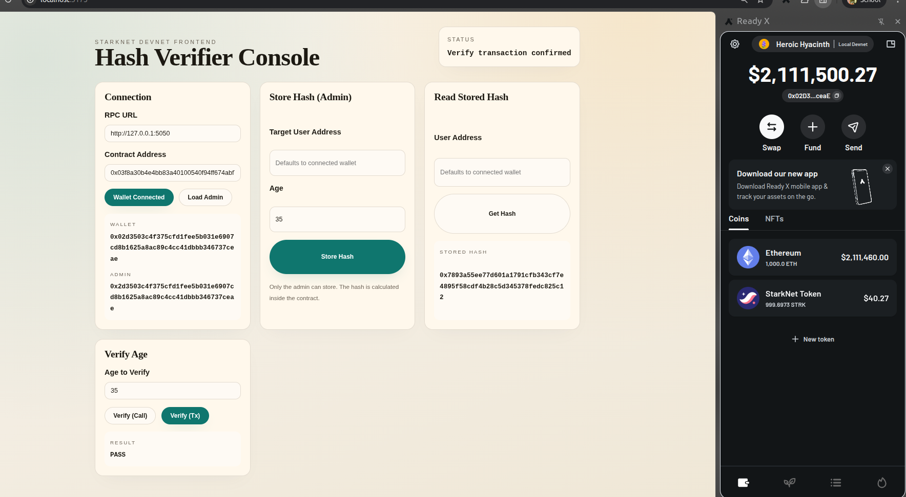

# Hash Verifier (Cairo StarkNet Contract)

## Overview
This assignment implements a Hash Verifier StarkNet contract in Cairo. The contract stores a hash for each user and later verifies a provided age by recomputing its hash and enforcing a minimum age constraint. The design demonstrates:

- Hashing with Poseidon
- On-chain storage with a Map
- Admin-only state updates
- Deterministic verification using stored hashes

## Core Concept
Instead of storing or exposing raw data, we store a cryptographic hash of the data. To verify later, we recompute the hash from the provided input and compare it with the stored hash. This ensures the input matches the commitment without revealing the original input during storage.

### 1) Install toolchain (Ubuntu)
Install Scarb (Cairo build tool):
`curl --proto '=https' --tlsv1.2 -sSf https://docs.swmansion.com/scarb/install.sh | sh`

Open a new terminal, then verify:
`scarb --version`

Install Starknet Foundry (sncast):
`curl --proto '=https' --tlsv1.2 -sSf https://sh.starkup.dev | sh`

Open a new terminal, then verify:
`sncast --version`

### 2) Build and test the contract

## Hash Function
Poseidon is used because it is efficient in ZK contexts and available in Cairo core. The hash function works on `felt252` values, so we convert the `u64` age into a `felt252` before hashing.

## Contract Design
### Storage (StarkNet)
- `admin`: the contract administrator
- `hashes`: a Map from `ContractAddress` to `felt252`

### Public Interface
- `store_hash(user, age)`
  - Admin-only
  - Computes Poseidon hash of age
  - Stores it for the user
  - Emits `HashStored`

- `verify_hash(age) -> bool`
  - Uses the caller address as the key
  - Recomputes the hash from `age`
  - Compares with stored hash
  - Enforces `age >= 18`
  - Emits `HashVerified`

- `get_hash(user) -> felt252`
  - Returns the stored hash

- `get_admin() -> ContractAddress`

Notes:
- `sncast declare` prints the class hash you need for deploy.
- `ADMIN_ADDRESS` should be a devnet account address (usually the account connected in your wallet).

### Frontend setup
From the frontend folder:

`npm install`
`npm run dev -- --host 0.0.0.0`

## Frontend UI Field Guide
These inputs come from your local devnet and deploy steps.

### RPC URL
- Use the devnet RPC URL: `http://127.0.0.1:5050`

### Contract Address
- This is returned by `sncast deploy` as the deployed contract address.

### Target User Address (Store Hash)
- The user whose hash will be stored. You can leave it empty to default to the connected wallet address.

### User Address (Read Stored Hash)
- The user whose stored hash you want to read. Leave empty to default to the connected wallet address.

### Admin
- The admin is the address passed as `ADMIN_ADDRESS` during deploy.
- Only the admin can call `store_hash` (Store Hash panel).

### Verify Age
- The verify call recomputes the hash from the input age and compares it to the stored hash for the connected wallet address. It also enforces age >= 18.
- The read-only verify uses a view method (`verify_hash_for`) that checks a specific address.
  - Returns current admin

- `transfer_admin(new_admin)`
  - Admin-only
  - Transfers ownership to a new admin
  - Emits `AdminTransferred`

### Verification Rules
Verification succeeds only if all conditions hold:
1. A hash is stored for the caller (non-zero)
2. Recomputed hash equals the stored hash
3. Age constraint is satisfied (age >= 18)

## Files
- `src/lib.cairo` - Contract and helper functions
- `src/tests.cairo` - Unit tests for hashing and verification logic
- `Scarb.toml` - Project configuration

## How to Run
From the assignment folder:

- Build the contract:
  `scarb build`

- Run tests:
  `scarb test`

## Local Devnet (Bonus Frontend)
This section is optional and only needed for the frontend. The core assignment is the Cairo contract.

### Start a local devnet (Docker - recommended on Ubuntu)
This avoids Python package issues.

`docker run --rm -p 5050:5050 shardlabs/starknet-devnet-rs:latest`

Devnet prints prefunded accounts (address + private key). Use one of those accounts in your wallet.

### Start a local devnet
If you have Python installed:

`pip install starknet-devnet`

Run:

`starknet-devnet`

Default RPC:
`http://127.0.0.1:5050`

### Deploy the contract (example using sncast)
If you already have sncast configured for devnet, use:

`scarb build`
`sncast --profile devnet declare --contract-name HashVerifier`
`sncast --profile devnet deploy --class-hash <CLASS_HASH> --arguments <ADMIN_ADDRESS>`

If sncast is not installed, you can install it using asdf (installed by starkup):
`~/.local/bin/asdf plugin add starknet-foundry`
`~/.local/bin/asdf install starknet-foundry latest`
`~/.local/bin/asdf set -u starknet-foundry latest`

Then import a devnet account (example uses one prefunded account):
`sncast account import --name devnet --address <ACCOUNT_ADDRESS> --type open-zeppelin --class-hash <ACCOUNT_CLASS_HASH> --private-key <PRIVATE_KEY> --url http://127.0.0.1:5050 --add-profile devnet --silent`

Save the deployed contract address. You will paste it into the frontend.

### Run the frontend
From the frontend folder:

`npm install`
`npm run dev -- --host 0.0.0.0`

Then open the dev server URL and use the UI.

## Step 2: Connect the UI (Quick Flow)
1) Open the frontend URL (usually `http://localhost:5173`).
2) RPC URL: `http://127.0.0.1:5050`.
3) Contract Address: paste the address printed by `sncast deploy`.
4) Connect Wallet (must be on Local Devnet).
5) Load Admin (should match the admin address used at deploy).
6) Store Hash (Admin): enter age, optionally a target user, click Store Hash.
7) Verify Age: enter age, click Verify (Call) or Verify (Tx). The verify call uses the connected wallet address.

## Notes
- This is an educational example. Do not store real secrets on-chain.
- Hashes are stored for addresses, but the raw age is never stored.
- The admin role is used to control who can store or update hashes.
